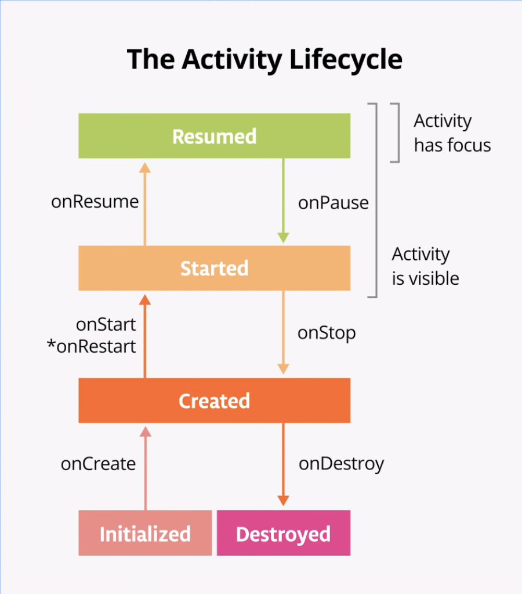
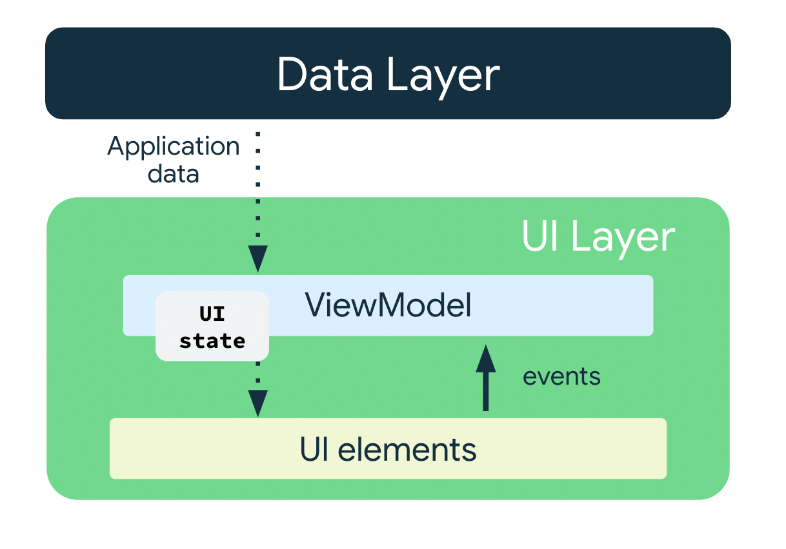

# Use State
- `State`: immutable
- `MutableState`: mutable
- `MutableStateOf()`: observable of a mutable state
- `remember()`: store an object across recompositions

```kotlin
@Composable
fun EditNumberField(modifier: Modifier = Modifier) {
    var amountInput: MutableState<String> = mutableStateOf("0")
    TextField(
        value = amountInput.value,
        onValueChange = { amountInput.value = it },
        modifier = modifier
    )
}
```
```kotlin
@Composable
fun EditNumberField(modifier: Modifier = Modifier) {
   var amountInput by remember { mutableStateOf("") }
   TextField(
       value = amountInput,
       onValueChange = { amountInput = it },
       modifier = modifier
   )
}
```
## State hoisting
- `State` is hoisted to the parent composable it requires the state and the function to update the state

## other
```kotlin
Column(
    modifier = Modifier
        .padding(40.dp)
        .verticalScroll(rememberScrollState()),
    horizontalAlignment = Alignment.CenterHorizontally,
    verticalArrangement = Arrangement.Center
) {
    TextField(
        //...
        keyboardOptions = KeyboardOptions.Default.copy(
            keyboardType = KeyboardType.Number,
            imeAction = ImeAction.Next //.send, .go, .search, .send, .done, .none
        )
    )
}
```

# Stages of the Activity Lifecycle

- `rememberSaveable()`: store an object across configuration changes

```kotlin
var count by rememberSaveable { mutableStateOf(0) }
```

Your summary covers the key points well, but here are some additions and clarifications to make it more comprehensive:

---

### **Additions/Improvements:**

1. **State Observation in Composables:**
  - To observe the `StateFlow` in Compose, use `collectAsState()`:
    ```kotlin
    @Composable
    fun GameApp(viewModel: GameViewModel) {
        val uiState by viewModel.uiState.collectAsState() // Observe state changes
        Text(text = "Level: ${uiState.level}")
    }
    ```
  - This ensures the UI updates automatically when the state changes.

2. **Unidirectional Data Flow:**
  - The UI sends **events** (e.g., button clicks) to the `ViewModel`, which processes logic and updates the state. The state flows back to the UI, creating a unidirectional cycle:
    ```
    UI → Event → ViewModel → Update State → UI
    ```

3. **Lifecycle Scope:**
  - `ViewModel` survives configuration changes (e.g., screen rotation) but is cleared when the associated activity/fragment is destroyed permanently.

4. **Testing Benefits:**
  - Separating UI logic into `ViewModel` makes it easier to unit test without needing Android components.

5. **StateFlow vs. mutableStateOf:**
  - `StateFlow` is for observable state holding in Kotlin Flows, while `mutableStateOf` is Compose's built-in state observable. The codelab uses `StateFlow` with `collectAsState()` to bridge flows into Compose.

6. **Dependency Injection (Optional):**
  - ViewModels can accept repositories or data sources as parameters (via Factory) for better separation of concerns.

---

### **Revised Summary:**

# ViewModel
- **`ViewModel`**: Manages UI-related data in a lifecycle-aware manner. Survives configuration changes (e.g., screen rotation) but is cleared when the activity is permanently destroyed. Decouples business logic from UI components for testability.

## Architecture

- **UI Layer**:
  - **UI Elements**: Jetpack Compose components that render data.
  - **State Holders** (e.g., `ViewModel`): Hold and expose UI state, handle logic. Follow unidirectional data flow (UI → events → ViewModel → updated state → UI).
- **Data Layer**: Manages data retrieval (e.g., databases, network).

## Key Code Snippets
```kotlin
// State Holder
data class GameUiState(val level: Int = 0)

class GameViewModel : ViewModel() {
    // Backing property to encapsulate mutable state
    private val _uiState = MutableStateFlow(GameUiState())
    val uiState: StateFlow<GameUiState> = _uiState.asStateFlow()

    fun nextLevel() {
        _uiState.update { it.copy(level = it.level + 1) }
    }
}

// Compose UI (Observes State)
@Composable
fun GameApp(viewModel: GameViewModel) {
    val uiState by viewModel.uiState.collectAsState() // Convert Flow to Compose State
    Text(text = "Level: ${uiState.level}")
    Button(onClick = { viewModel.nextLevel() }) { Text("Next Level") }
}

// Activity Setup
class GameActivity : ComponentActivity() {
    private val viewModel: GameViewModel by viewModels()
    override fun onCreate(savedInstanceState: Bundle?) {
        super.onCreate(savedInstanceState)
        setContent { GameApp(viewModel) }
    }
}
```

## Key Concepts
- **Backing Property**: Encapsulates mutable state (`_uiState`), exposing only an immutable `StateFlow` to the UI.
- **StateFlow**: A lifecycle-aware observable flow for state management. Use `collectAsState()` in Compose to observe it.
- **Lifecycle Awareness**: The `ViewModel` is scoped to the activity’s lifecycle, surviving configuration changes.

## Additional Points

```kotlin
@Composable
fun SearchBar() {
    val query = remember { mutableStateOf("") } // Local state
    TextField(
        value = query.value,
        onValueChange = { query.value = it }
    )
}
```


### **What is `mutableStateOf()`?**
- **`mutableStateOf()`** is a **Jetpack Compose-specific API** for creating observable state objects. When the value changes, Compose automatically triggers a recomposition of the UI components that read that state.
- It is designed for **local UI state** (e.g., text field values, toggle states) within a composable function.
- Unlike `StateFlow`, it is tied to the **lifecycle of the composable** where it’s declared. If the composable leaves the composition, the state is destroyed.

### **Key Differences: `mutableStateOf()` vs. `StateFlow`**
| Feature                     | `mutableStateOf()`                          | `StateFlow`                                  |
|-----------------------------|---------------------------------------------|---------------------------------------------|
| **Scope**                   | Local to a composable.                      | Can survive composable/activity recreation. |
| **Use Case**                | Simple UI state (e.g., button clicks).      | Business logic/data that needs to survive configuration changes. |
| **Lifecycle Awareness**     | Tied to composable lifecycle.               | Tied to `ViewModel`/activity lifecycle.     |
| **Observation**             | Directly observed in Compose.               | Observed via `collectAsState()` in Compose. |
| **State Sharing**           | Not shared across composables by default.   | Shared across composables via `ViewModel`.  |


### **Best Practices**
1. **Avoid `mutableStateOf` in `ViewModel`**:  
   Use `StateFlow` in the `ViewModel` instead. `mutableStateOf` is tied to Compose’s recomposition system and isn’t lifecycle-aware outside composables.

2. **Use `remember` with `mutableStateOf`**:  
   Always wrap `mutableStateOf` in `remember` to preserve state across recompositions:
   ```kotlin
   val textState = remember { mutableStateOf("") }
   ```

3. **State Hoisting**:  
   If a state needs to be shared between composables or survive configuration changes, lift it to a `ViewModel` and use `StateFlow`.


```kotlin
// Declare private mutable variable that can only be modified
// within the class it is declared.
private var _count = 0 

// Declare another public immutable field and override its getter method. 
// Return the private property's value in the getter method.
// When count is accessed, the get() function is called and
// the value of _count is returned. 
val count: Int
    get() = _count
```

## Unidirectional Data Flow(UDF)
- `Event`: Part of the UI generates an event and passes it upward—such as a button click passed to the ViewModel to handle—or an event that is passed from other layers of your app, such as an indication that the user session has expired.
- `Update state`: An event handler might change the state.
- `Display state`: The state holder passes down the state, and the UI displays it.

### The use of the UDF pattern for app architecture has the following implications:
- The ViewModel holds and exposes the state the UI consumes.
- The UI state is application data transformed by the ViewModel.
- The UI notifies the ViewModel of user events.
- The ViewModel handles the user actions and updates the state.
- The updated state is fed back to the UI to render.
- This process repeats for any event that causes a mutation of state.


# Kotlin vibes

## Generic data type
```kotlin
class Question<T>(val question: String, val answer: T)

fun main() {
    Question("What is your name?", "John")
    Question("What is your age?", 25)
}
```

## Enum
```kotlin
enum class Direction {
    NORTH, SOUTH, EAST, WEST
}
```

## Data
```kotlin
data class Person(val name: String, val age: Int)
```
### Notes
- `data class`: automatically generates `equals()`, `hashCode()`, `toString()`, and `copy()` methods
- `componentN()`: allows destructuring
- cannot be `abstract`, `open`, `sealed`, or `inner`

## Singleton
```kotlin
object Singleton {
    fun doSomething() {
        println("Doing something")
    }
}
```

## Companion object
```kotlin
class MyClass {
    class CompanionClass {
        fun doSomething() {
            println("Doing something")
        }
    }
    companion object {
        fun doSomething() {
            println("Doing something")
        }
    }
}
```

## Extension (property, method)
```kotlin
// new property (lastChar) in the String class
val String.lastChar: Char
    get() = get(length - 1) // must define a getter

// new method (removeLastChar) in the String class
fun String.removeLastChar(): String = substring(0, length - 1)

fun String.removeCharAt(index: Int): String { return substring(0, index) + substring(index + 1) }
```

## Interface
```kotlin
interface MyInterface {
    fun doSomething()
}
class MyClass : MyInterface {
    override fun doSomething() {
        println("Doing something")
    }
}
```

## Extension class

```kotlin
open class Shape(val color: String) { // open: can be inherited

    fun draw() {
        println("Drawing a shape")
    }
}

// extends the Shape class
class Circle(val radius: Int, color: String) : Shape(color) 
```

## Scope

```kotlin
import java.util.*

fun main() {
    val name = "John"
    name.let {
        println(it.uppercase(Locale.getDefault()))
        println(it.length)
    }
    Shape("blue").apply { // enables calling the method without a reference
        draw()
    }
}
```