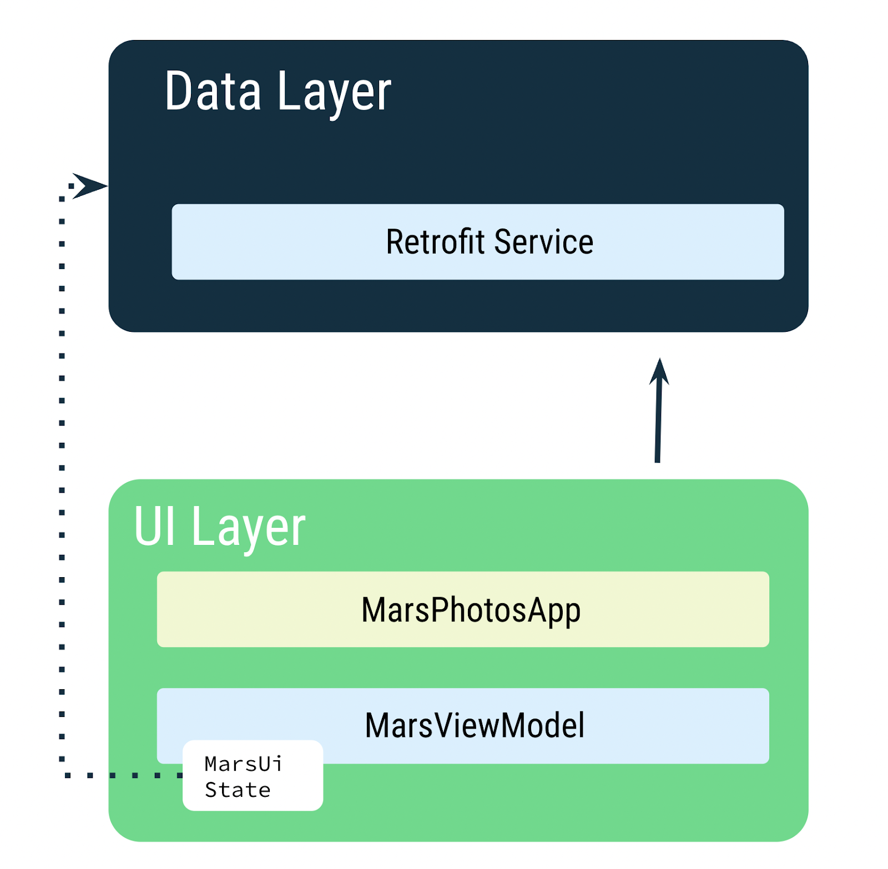
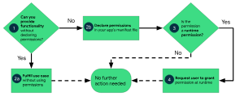
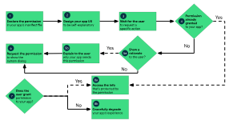

# Nav

>`NavController`: Responsible for navigating between destinations—that is, the screens in your app.

>`NavGraph`: Maps composable destinations to navigate to.

>`NavHost`: Composable acting as a container for displaying the current destination of the NavGraph.

## Routes
```kotlin
enum class Screen() {
    Home,
    Profile,
    Cart
}
```

## NavHost
```kotlin
NavHost(
    navController = navController, 
    startDestination = Screen.Home.name,
    modifier = Modifier.padding(innerPadding)
) {
    composable(Screen.Home.name) { HomeScreen(navController) }
    composable(Screen.Profile.name) { ProfileScreen(navController) }
    composable(Screen.Cart.name) { CartScreen(navController) }
}
```

## Navigation methods
> navController.currentBackStackEntryAsState()  // just so you know
> backStackEntry?.destination?.route


### Navigate to a screen
```kotlin
navController.navigate(Screen.Profile.name) // route String
```
### Navigate back
```kotlin
navController.popBackStack(Screen.Profile.name, inclusive = false) // route String and inclusive Boolean
```
inclusive: If true, the destination specified in the popBackStack call is also popped. If false, only the destinations after the specified destination are popped.
> if true: home/profile/cart -> home; else home/profile/cart -> home/profile

## Nav to other apps
### Intent
```kotlin
private fun shareOrder(context: Context, subject: String, summary: String) {
    val intent = Intent(Intent.ACTION_SEND).apply {                             // create an intent with the action of sending data
        type = "text/plain"                                                     // the type of additional data that is supplied, (image/*, audio/*, video/*, etc.)
        putExtra(Intent.EXTRA_SUBJECT, subject)                                 // the subject of the message
        putExtra(Intent.EXTRA_TEXT, summary)                                    // the text of the message
    }
    context.startActivity(                                                      // start the activity
            Intent.createChooser(                                               // create a chooser
                intent,                                                         // the intent to create a chooser for
                context.getString(R.string.new_cupcake_order)                   // the title of the chooser
            )
        )
    }
```

## [updates](https://pl-coding.com/2024/10/02/official-type-safe-navigation-with-compose/)

# Rest 
## Sysnchronous
```kotlin
fun main() {
    val time = measureTimeMillis {
        runBlocking {
            printForecast()
        }
    }
    println("Execution time: ${time / 1000.0} seconds")
}
suspend fun printForecast() {
    delay(1000)
    println("Sunny")
}
```
- `runBlocking{}`: can be use to run a suspending function in a synchronous way
- suspend: A function that can be paused and resumed at a later time. Suspending functions can execute in a coroutine.
- `measureTimeMillis{}`: measures the time taken to execute a block of code in milliseconds.

## Asynchronous
```kotlin
fun main() {
    runBlocking {
        println("Weather forecast")
        println(getWeatherReport())
        println("Have a good day!")
    }
}

suspend fun getWeatherReport() = coroutineScope {
    val forecast: Deferred<String> = async { getForecast() }
    val temperature = async {
        try {
            getTemperature()
        } catch (e: AssertionError) {
            println("Caught exception $e")
            "{ No temperature found }"
        }
    }
//    delay(200)
//    temperature.cancel()
    "${forecast.await()} ${temperature.await()}"
}

suspend fun getForecast(): String {
    delay(1000)
    return "Sunny"
}

suspend fun getTemperature(): String {
    delay(500)
    throw AssertionError("Temperature is invalid")
    return "30\u00b0C"
}
```
- `launch{}`: starts a new coroutine and returns a reference to the coroutine as a Job.
- `coroutineScope{}`: creates a new coroutine scope. The coroutines launched within this scope are grouped together.
- `async{}`: creates a new coroutine and returns a reference to the coroutine as a Deferred. A Deferred is a light-weight non-blocking future that represents a promise to provide a result later.
- parallel decomposition: The process of breaking down a task into smaller tasks that can be executed in parallel.

## Coroutine Concepts

- Job: A handle to a coroutine that can be used to cancel the coroutine.

### Job hierarchy
```kotlin
val job = launch {
    ...            

    val childJob = launch { ... }

    ...
}
job.cancel()
```
If a job fails with an exception, it cancels its parent with that exception. This is known as propagating the error upwards (to the parent, the parent's parent, and so on).

### CoroutineScope
A CoroutineScope is tied to a lifecycle, which sets bounds on how long the coroutines within that scope will live. 
If a scope gets cancelled, then its job is cancelled, and the cancellation of that propagates to its child jobs. 
If a child job in the scope fails with an exception, then other child jobs get cancelled, the parent job gets cancelled, and the exception gets re-thrown to the caller.
Android provides coroutine scope support in entities that have a well-defined lifecycle, such as Activity (lifecycleScope) and ViewModel (viewModelScope)

### CoroutineContext
A CoroutineContext is a set of elements that define the behavior of a coroutine. 

name - name of the coroutine to uniquely identify it (there is a default name)
job - controls the lifecycle of the coroutine
dispatcher - dispatches the work to the appropriate thread
exception handler - handles exceptions thrown by the code executed in the coroutine

They can be defined using the `+` operator
> Job() + Dispatchers.Main + exceptionHandler

### Dispatcher
A Dispatcher is a coroutine context element that determines the thread on which the coroutine runs.

- Dispatchers.Main: Dispatches the coroutine to the main thread. This dispatcher is used for UI-related work.
- Dispatchers.IO: Dispatches the coroutine to a shared pool of threads. This dispatcher is used for network and disk I/O operations.
- Dispatchers.Default: Dispatches the coroutine to a shared pool of threads. This dispatcher is used for CPU-intensive work.

```kotlin
fun main() {
    runBlocking {
        launch(Dispatchers.IO) {
            println("Running on ${Thread.currentThread().name}")
        }
    }
}
```

# Rest (REpresentational State Transfer)


## Retrofit
```kotlin

private const val BASE_URL =
    "https://android-kotlin-fun-mars-server.appspot.com"

private val retrofit = Retrofit.Builder()
    .addConverterFactory(ScalarsConverterFactory.create()) // ScalarsConverterFactory: A Converter.Factory for converting strings.
    .baseUrl(BASE_URL)
    .build()


interface MarsApiService {
    @GET("photos")
    fun getPhotos(): String //suspend
}

object MarsApi { // Singleton
    val retrofitService : MarsApiService by lazy {
        retrofit.create(MarsApiService::class.java)
    }
}

private fun getMarsPhotos() {
    viewModelScope.launch {
        marsUiState = try {
            val listResult = MarsApi.retrofitService.getPhotos()
            MarsUiState.Success(listResult)
        } catch (e: IOException) {
            MarsUiState.Error
        }
    }
}
```
- `.addConverterFactory(converter)`: The converter tells Retrofit what to do with the data it gets back from the web service
- `<uses-permission android:name="android.permission.INTERNET" />` in the manifest file, before the aplication tag

## parse JSON
```kotlin
@Serializable
data class MarsPhoto(
    val id: String,
    @SerialName(value = "img_src")
    val imgSrc: String
)

private val retrofit = Retrofit.Builder()
    .addConverterFactory(Json.asConverterFactory("application/json".toMediaType()))
    .baseUrl(BASE_URL)
    .build()

interface MarsApiService {
    @GET("photos")
    suspend fun getPhotos(): List<MarsPhoto>
}
```


# Some Notes



- [kotlin asyn(29+)](https://docs.google.com/presentation/d/1COEiWNknSmiI5RUgxumLrgscl9d-yvKoj6tjNF9jw5A/edit?slide=id.g796a0b0491_0_730#slide=id.g796a0b0491_0_730)
- [kotlin web](https://docs.google.com/presentation/d/1osOpeT2U4JnJpSP4YUk7SJ6qAsqxm4FIRw0q6CEvLRo/edit?slide=id.gb8d17af4dc_0_487#slide=id.gb8d17af4dc_0_487)
- [request permissions](https://developer.android.com/training/permissions/requesting)
- [permissions](https://developer.android.com/guide/topics/permissions/overview)