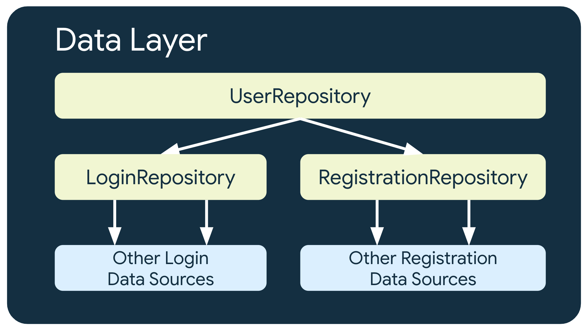
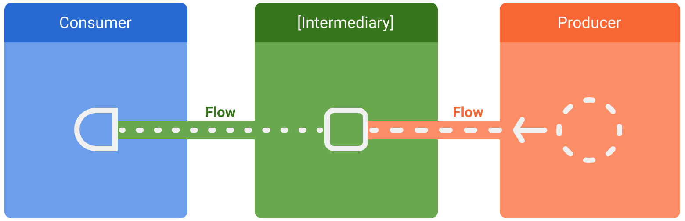
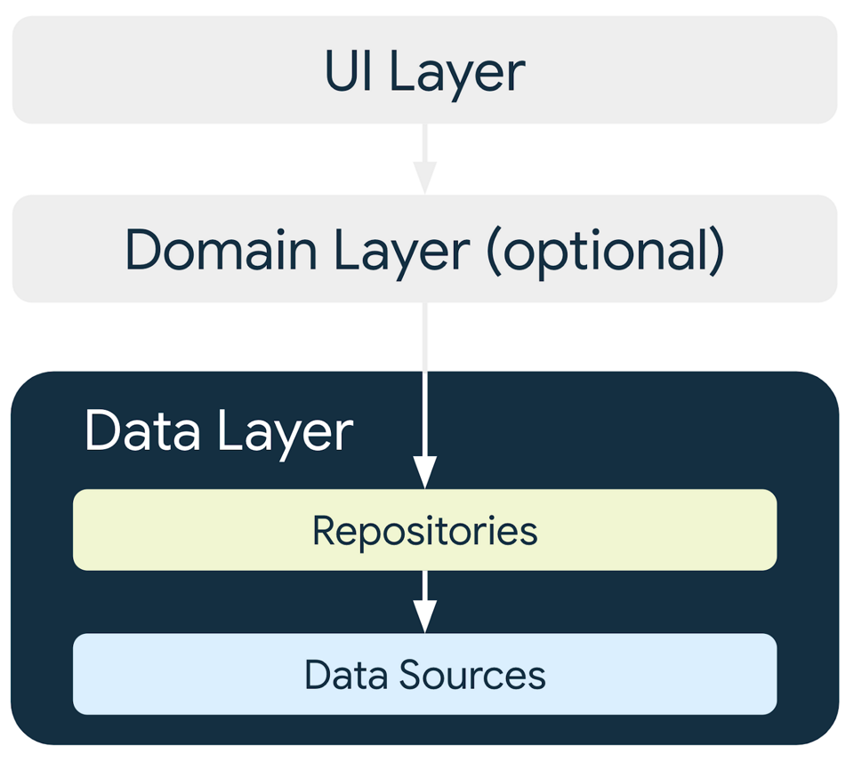
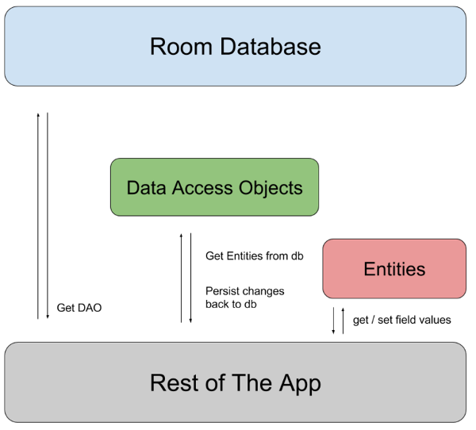
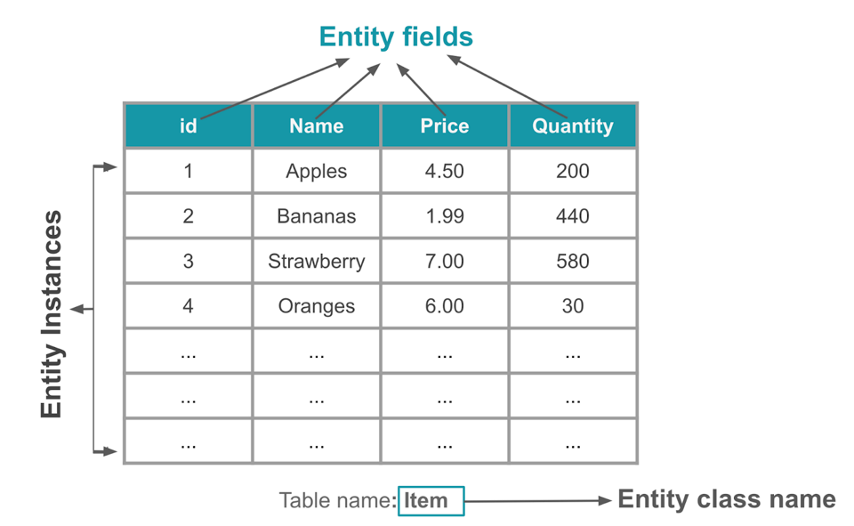
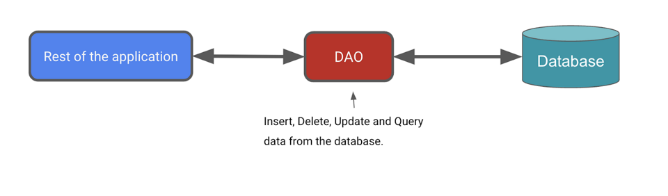

# Data layer
## Repository
- Exposing data to the rest of the app.
- Centralizing changes to the data.
- Resolving conflicts between multiple data sources.
- Abstracting sources of data from the rest of the app.
- Containing business logic.
- The data exposed by this layer should be immutable

### Expose APIs
- `One-shot operations`: The data layer should expose suspend functions in Kotlin; and for the Java programming language, the data layer should expose functions that provide a callback to notify the result of the operation, or RxJava Single, Maybe, or Completable types.
- `To be notified of data changes over time`: The data layer should expose flows in Kotlin; and for the Java programming language, the data layer should expose a callback that emits the new data, or the RxJava Observable or Flowable type.

### Multiple levels of repositories


### Types of data operations
- `UI-oriented operations`: These operations are used to fetch data for the UI. They are typically one-shot operations that return the data once.,(like in on screen)
- `App-oriented operations`: These operations are used to fetch data for the app. They are typically one-shot operations that return the data once.
- `Business-oriented operations`: These operations are used to fetch data for the business logic of the app. They are typically one-shot operations that return the data once. (can not be canceled)

### [otheres](https://developer.android.com/topic/architecture/data-layer#architecture)

## Kotlin flows

- `Flow`: A flow is a type that can emit multiple values sequentially, as opposed to suspend functions that return only a single value.
- [Flow](https://developer.android.com/kotlin/flow)
- 
### Flow Builder
 ```kotlin
 class NewsRemoteDataSource(
    private val newsApi: NewsApi,
    private val refreshIntervalMs: Long = 5000
) {
    val latestNews: Flow<List<ArticleHeadline>> = flow {
        while(true) {
            val latestNews = newsApi.fetchLatestNews()
            emit(latestNews) // Emits the result of the request to the flow
            delay(refreshIntervalMs) // Suspends the coroutine for some time
        }
    }
}

// Interface that provides a way to make network requests with suspend functions
interface NewsApi {
    suspend fun fetchLatestNews(): List<ArticleHeadline>
}
 ```

### [DataStore](https://developer.android.com/codelabs/android-preferences-datastore#3)

# Persist data with Room

## Room
Because each data source should have the responsibility of working with only one source for a specific type of data, a Room data source would receive either a data access object (DAO) or the database itself as a parameter. For example, NewsLocalDataSource might take an instance of NewsDao as a parameter, and AuthorsLocalDataSource might take an instance of AuthorsDao.


- `Room Entity`: Represents a table in the database.You use them to update the data stored in rows in tables and to create new rows for insertion.
- `Room DAO`: Data Access Object, contains the methods used for accessing the database.
- `Room Database`: is the database class that provides your app with instances of the DAOs associated with that database.

### Room Entity

```kotlin
@Entity(tableName = "items")
data class Item(
    @PrimaryKey(autoGenerate = true)
    val id: Int = 0, // 0 is the default value it is needed for the autoGenerate
    val name: String,
    val price: Double,
    val quantity: Int
)
```
### Room DAO

The Data Access Object (DAO) is a pattern you can use to separate the persistence layer from the rest of the application by providing an abstract interface. This isolation follows the single-responsibility principle.
```kotlin
@Dao
interface ItemDao {
    @Query("SELECT * from items ORDER BY name ASC")
    fun getAllItems(): Flow<List<Item>>

    @Insert(onConflict = OnConflictStrategy.IGNORE)
    fun insert(item: Item)

    @Update
    suspend fun update(item: Item)

    @Delete
    fun delete(item: Item)

    @Query("SELECT * from items WHERE id = :id")
    fun getItem(id: Int): Flow<Item> 
    // With Flow as the return type, you receive notification whenever the data in the database changes.
}
```

### Room Database

```kotlin
@Database(entities = [Item::class], version = 1, exportSchema = false)
abstract class InventoryDatabase : RoomDatabase() {

    abstract fun itemDao(): ItemDao

    companion object {
        @Volatile // The value of a volatile variable will never be cached, and all writes and reads will be done to and from the main memory.
        private var Instance: InventoryDatabase? = null

        fun getDatabase(context: Context): InventoryDatabase {
            // if the Instance is not null, return it, otherwise create a new database instance.
            return Instance ?: synchronized(this) {
                Room.databaseBuilder(context, InventoryDatabase::class.java, "item_database")
                    .fallbackToDestructiveMigration()
                    .build()
                    .also { Instance = it }
            }
        }
    }
}
```

### Repository
```kotlin
/**
* Repository that provides insert, update, delete, and retrieve of [Item] from a given data source.
*/
interface ItemsRepository {
    /**
     * Retrieve all the items from the the given data source.
     */
    fun getAllItemsStream(): Flow<List<Item>>

    /**
     * Retrieve an item from the given data source that matches with the [id].
     */
    fun getItemStream(id: Int): Flow<Item?>

    /**
     * Insert item in the data source
     */
    suspend fun insertItem(item: Item)

    /**
     * Delete item from the data source
     */
    suspend fun deleteItem(item: Item)

    /**
     * Update item in the data source
     */
    suspend fun updateItem(item: Item)
}
```

## AppContainer
```kotlin
override val itemsRepository: ItemsRepository by lazy {
    OfflineItemsRepository(InventoryDatabase.getDatabase(context).itemDao())
}
```

# Read and update with Room

- `Collecting data from a Flow`: To collect data from a Flow, you can use the collect method. The collect method is a suspending function that can be called from a coroutine.
```kotlin
val homeUiState: StateFlow<HomeUiState> =
    itemsRepository.getAllItemsStream().map { HomeUiState(it) }
        .stateIn(
            scope = viewModelScope,
            started = SharingStarted.WhileSubscribed(TIMEOUT_MILLIS),
            initialValue = HomeUiState()
        )
```

## [test](https://developer.android.com/codelabs/basic-android-kotlin-compose-update-data-room?continue=https%3A%2F%2Fdeveloper.android.com%2Fcourses%2Fpathways%2Fandroid-basics-compose-unit-6-pathway-2%23codelab-https%3A%2F%2Fdeveloper.android.com%2Fcodelabs%2Fbasic-android-kotlin-compose-update-data-room#4)

# Mobile Backend-as-a-Service (MBaaS)
- `Cloud Firestore`: Firebase data model, NoSQL database, document-oriented

- [Text](httpsffifirefffasdfffadsfdasfasdfasdffffadsfadsfasdfadsdfadfasdfasdfa.k,.nn,.n,dfafdasdfaasdfasdf
- asdfasdfasdfa://firebase.google.com/codelabs/firebase-android#0)