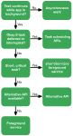

# WorkManager


- `Worker`: Perform background work synchronously
- `CoroutineWorker`: Perform background work asynchronously (Kotlin coroutines)
  - `doWork()`: Perform work synchronously (must override)
- `WorkRequest`: Requests to do some work (once or periodically), can have `Constraints`
  - `OneTimeWorkRequest`: Do work once
  - `PeriodicWorkRequest`: Do work periodically
- `ẀorkManager`: Schedules and runs `WorkRequest`, it will try to spread the load, while honoring the constraints

```kotlin
class FetchDataWorker(context: Context, workerParams: WorkerParameters) :
    CoroutineWorker(context, workerParams) {

    override suspend fun doWork(): Result {
        ...
        
        return withContext(Dispatchers.IO) {
            return@withContext try {
                val result = fetchData(inputData.getString("uri", ""))
                val outputData = workDataOf("result" to result)
                Result.success(outputData)
            } catch (e: Exception) {
                Result.retry() // .failure()
            }
        }
    }
}

class WorkManagerActivity(context: Context) {
    private val workManager = WorkManager.getInstance(context)

    fun fetchData(uri: Uri) {
        val constraints = Constraints.Builder()
            .setRequiredNetworkType(NetworkType.CONNECTED)
            .build()

        val workRequest = OneTimeWorkRequestBuilder<FetchDataWorker>()
            .setConstraints(constraints)
            .setInputData(workDataOf("uri" to uri.toString()))
            .build()

        workManager.enqueue(workRequest)
    }
}
```

## Chaining work
```kotlin
class WorkManagerActivity(context: Context) {
    private val workManager = WorkManager.getInstance(context)

    fun fetchData(uri: Uri) {
        val constraints = Constraints.Builder()
            .setRequiredNetworkType(NetworkType.CONNECTED)
            .build()

        // Fetch data
        val workRequest = OneTimeWorkRequestBuilder<FetchDataWorker>()
            .setConstraints(constraints)
            .setInputData(workDataOf("uri" to uri.toString()))
            .build()

        // Process data (input is automatically received from FetchDataWorker's output)
        val workRequest2 = OneTimeWorkRequestBuilder<ProcessDataWorker>()
            .setConstraints(constraints)
            .build()

        // Save data (input is automatically received from ProcessDataWorker's output)
        val workRequest3 = OneTimeWorkRequestBuilder<SaveDataWorker>()
            .setConstraints(constraints)
            .build()

        workManager.beginWith(workRequest)
            .then(workRequest2)
            .then(workRequest3)
            .enqueue()
    }
}
```
```kotlin
class FetchDataWorker(context: Context, params: WorkerParameters) : Worker(context, params) {
    override fun doWork(): Result {
        val uriString = inputData.getString("uri")
        // Perform data fetching...
        val resultData = workDataOf("result" to "processedData")
        return Result.success(resultData)
    }
}

class ProcessDataWorker(context: Context, params: WorkerParameters) : Worker(context, params) {
    override fun doWork(): Result {
        val processedInput = inputData.getString("result")
        // Process data...
        val saveData = workDataOf("data" to "finalData")
        return Result.success(saveData)
    }
}

class SaveDataWorker(context: Context, params: WorkerParameters) : Worker(context, params) {
    override fun doWork(): Result {
        val dataToSave = inputData.getString("data")
        // Save data...
        return Result.success()
    }
}
```

# Field injection
```kotlin
@HiltAndroidApp // Hilt annotation to generate Hilt components
class LogApplication : Application() {
    ...
}
@AndroidEntryPoint //  it tells Hilt to generate a new component for the MainActivity
class LogsFragment : Fragment() {

  @Inject lateinit var logger: LoggerLocalDataSource // Field injection
  @Inject lateinit var dateFormatter: DateFormatter

  ...
}
@Singleton // Hilt annotation to specify the scope of the LoggerLocalDataSource
class LoggerLocalDataSource @Inject constructor(private val logDao: LogDao) {
  ...
}
@InstallIn(SingletonComponent::class) // Hilt annotation to specify the component
@Module // module to provide the LoggerLocalDataSource
object DatabaseModule {

  @Provides
  fun provideLogDao(database: AppDatabase): LogDao {
    return database.logDao()
  }

  @Provides
  @Singleton
  fun provideDatabase(@ApplicationContext appContext: Context): AppDatabase {
    return Room.databaseBuilder(
      appContext,
      AppDatabase::class.java,
      "logging.db"
    ).build()
  }
}
@InstallIn(ActivityComponent::class)
@Module
abstract class NavigationModule {

  @Binds
  abstract fun bindNavigator(impl: AppNavigatorImpl): AppNavigator
}
```

```kotlin

@Qualifier // the qualifier is used to distinguish between the two LoggerDataSource implementations
annotation class InMemoryLogger

@Qualifier
annotation class DatabaseLogger

@InstallIn(SingletonComponent::class)
@Module
abstract class LoggingDatabaseModule {

    @DatabaseLogger
    @Singleton
    @Binds
    abstract fun bindDatabaseLogger(impl: LoggerLocalDataSource): LoggerDataSource
}

@InstallIn(ActivityComponent::class)
@Module
abstract class LoggingInMemoryModule {

    @InMemoryLogger
    @ActivityScoped
    @Binds
    abstract fun bindInMemoryLogger(impl: LoggerInMemoryDataSource): LoggerDataSource
}
class LogsContentProvider: ContentProvider() {

  @InstallIn(SingletonComponent::class)
  @EntryPoint
  interface LogsContentProviderEntryPoint {
    fun logDao(): LogDao
  }

  ...
}
```
- [test](https://developer.android.com/codelabs/android-hilt#9)
- [updated](https://insert-koin.io/docs/quickstart/android/)
# AI in Android
## Vertex AI (firebase)
- [how to connect](https://developer.android.com/codelabs/gemini-summarize?hl=en#3)

```kotlin

class GeminiRepositoryImpl: GeminiRepository {


    private val generativeModel = Firebase
        .vertexAI
        .generativeModel(
            modelName = "gemini-1.5-flash",
            generationConfig = generationConfig {
                temperature = 0f
            },
            safetySettings = listOf(
                SafetySetting(HarmCategory.HARASSMENT, HarmBlockThreshold.LOW_AND_ABOVE),
                SafetySetting(HarmCategory.HATE_SPEECH, HarmBlockThreshold.LOW_AND_ABOVE),
                SafetySetting(HarmCategory.SEXUALLY_EXPLICIT, HarmBlockThreshold.LOW_AND_ABOVE),
                SafetySetting(HarmCategory.DANGEROUS_CONTENT, HarmBlockThreshold.LOW_AND_ABOVE),
            )
        )

    override suspend fun summarizePost(post: Post): String? {
        val stringBuilder = StringBuilder()

        for (paragraph in post.paragraphs) {
            stringBuilder.append(paragraph.text)
        }

        val prompt =
            "Summarize the following article in 4 concise bullet points. " +
                    "Ensure each bullet point is specific, informative and relevant. " +
                    "Return just the bullet points as plain text. " +
                    "Use plain text, don't use markdown. \n $stringBuilder"

        return generativeModel.generateContent(prompt).text
    }

}
```                                                                                   


## Asynchronous work
VER FOLHA


